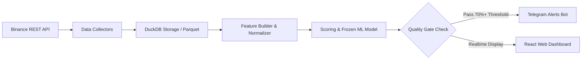

# 🪙 DAO VANG — PeakPulse AI

[](LICENSE)
[](#)

[🇻🇳 Tiếng Việt](README.md) | [🇬🇧 English](README.en.md) | [🇨🇳 简体中文](README.zh-CN.md) | [🇷🇺 Русский](README.ru.md) | [🇰🇷 한국어](README.ko.md)

---

> **Dao Vang — Machine Learning Distribution Radar**  
> *Early warning and forecasting system for Crypto Derivatives (Binance USD-M Futures) Top Formation / Distribution Phase powered by Machine Learning.*

---

## 🎯 1. OVERVIEW & INTRODUCTION

**Dao Vang** (Gold Miner) is an analytical platform designed for early detection and warning of price distribution/top formation signals (Distribution Phase / Pump & Dump) in the Crypto market based on real-time derivatives data (Point-in-Time Derivatives Data).

Unlike traditional technical analysis tools relying solely on OHLCV price action, **Dao Vang** combines deep money-flow metrics (Funding Rate, Open Interest, Taker Buy/Sell Ratio, Long/Short Account & Position Ratios) with a **Walk-Forward Validated Machine Learning model** to deliver highly reliable distribution probability estimates.

> 💡 **Operating Philosophy:** The system operates as a **passive alert radar** (Human-in-the-loop). Dao Vang **DOES NOT execute auto-trades (No Auto-Trading)**; all trading decisions remain 100% with the user.

---

## ✨ 2. KEY FEATURES

- 🔍 **Live Scanner Daemon (24/7):** Automatically scans hundreds of Binance Futures trading pairs in real-time across 5-minute candle cycles.
- 📊 **Candidate Filter v2 & Pump Filter Mechanisms:** Filters high-volatility coins, detecting capital flow anomalies and rapid reversal risks.
- 🤖 **Machine Learning & Self-Learning Daemon:**
  - Automated model calibration and continuous learning from live periodic data.
  - Rigorous model evaluation using **Walk-Forward Validation** (Zero Data Leakage / No look-ahead bias).
- 📲 **Telegram 24/7 Alerts:** Sends real-time signal notifications directly to personal/group Telegram channels, complete with comprehensive analytics and direct links to open the asset on the Dashboard.
- 💻 **Web Dashboard UI (React + Vite + TypeScript):**
  - Interactive Candlestick Charts (TradingView-style).
  - Real-time Signal Feed summary table.
  - System health monitor, backtest history, and flexible watchlist tracking.
- 🐳 **Docker Ready Packaging:** Ready for 1-click deployment via Docker & Docker Compose on VPS/Server setups.

---

## 🛠 3. TECHNICAL ARCHITECTURE (TECH STACK)

### 🔹 Backend & Data Engine (Python)
- **Core Framework:** Python 3.11+, Pydantic v2, Typer (CLI).
- **Web & API Server:** FastAPI, Uvicorn (RESTful APIs).
- **Data Engine & Storage:** DuckDB (Ultra-fast data analysis query engine), Apache Parquet, Pandas.
- **Logging & Security:** `structlog` integrated with automated secret redaction (`redact_secrets`).

### 🔹 Frontend (Web Dashboard)
- **Framework:** React 18, TypeScript, Vite.
- **Styling & UI:** Modern Vanilla CSS (Clean & Responsive).
- **Charts:** Lightweight Candlestick Charts & Real-time Feeds.

### 🔹 Machine Learning & Signal Processing
- **Validation Engine:** Walk-Forward Splitter, Event-based Validation, Out-of-fold Calibration.
- **Model Storage:** Frozen Model Bundles (Hash-verified metadata & config).

---

## 🔄 4. HOW IT WORKS (PIPELINE)



1. **Data Collection (Collect):** Scans 5m OHLCV candles, Open Interest, Funding Rate, Taker Volume, and Long/Short Ratio from Binance USD-M Futures.
2. **Normalization & As-of Join:** Precisely aligns data by timestamp (Point-in-Time), guaranteeing **Zero Lookahead Bias**.
3. **Feature Engineering:** Calculates money flow volatility indicators, OI vs Price ratio dynamics, and active Taker buy/sell momentum.
4. **Inference & Alert:** Passes features through the Frozen ML model to calculate distribution probability, checks Cooldown status, and pushes alerts to Telegram & Dashboard.

---

## 🔒 5. SECURITY & PRIVACY

- **No Secrets/Tokens in Git:** The `.env` file containing sensitive data (e.g., Telegram Bot Token) is strictly excluded by `.gitignore`.
- **Log Sanitization:** Automatically sanitizes sensitive key phrases (`api_key`, `secret`, `password`, `token`) prior to writing log files.
- **Public API Ready:** Does not require Binance API secret keys to scan (uses public endpoints), minimizing API key security risks.

---

## 🚀 6. QUICK START GUIDE

### Environment Setup
```bash
# Clone the repository
git clone https://github.com/mrcanlaco/dao_vang.git
cd dao_vang

# Install dependencies using uv / pip
pip install -e .
```

### Run Scanner & Web UI with Docker Compose
```bash
# Create configuration file from template
cp .env.docker.example .env.docker

# Launch the full system (Scanner + API Server + Frontend)
docker-compose up -d
```

---

*This project is designed following modern software engineering best practices: Point-in-time Correctness, Modular Architecture, and Strict Data Quality.*
