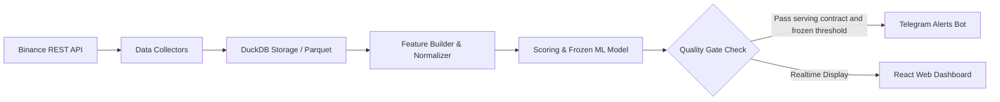

# 🪙 DAO VANG — PeakPulse AI

[](LICENSE)
[](#)

[🇻🇳 Tiếng Việt](README.md) | [🇬🇧 English](README.en.md) | [🇨🇳 简体中文](README.zh-CN.md) | [🇷🇺 Русский](README.ru.md) | [🇰🇷 한국어](README.ko.md)

---

> **Dao Vang — Machine Learning Distribution Radar**  
> *Early warning and forecasting system for Crypto Derivatives (Binance USD-M Futures) Top Formation / Distribution Phase powered by Machine Learning.*

---

## 🎯 1. OVERVIEW & INTRODUCTION

**Dao Vang** (Gold Miner) is an analytical platform designed for early detection and warning of price distribution/top formation signals (Distribution Phase / Pump & Dump) in the Crypto market based on real-time derivatives data (Point-in-Time Derivatives Data).

Unlike traditional technical analysis tools relying solely on OHLCV price action, **Dao Vang** combines deep money-flow metrics (Funding Rate, Open Interest, Taker Buy/Sell Ratio, Long/Short Account & Position Ratios) with a **Walk-Forward Validated Machine Learning model** to deliver highly reliable distribution probability estimates.

> 💡 **Operating Philosophy:** The system operates as a **passive alert radar** (Human-in-the-loop). Dao Vang **DOES NOT execute auto-trades (No Auto-Trading)**; all trading decisions remain 100% with the user.

---

## 🔎 2. PRODUCTION RELEASE STATUS

The production release is identified by a model ID and checksums, not by a
marketing label or metrics from a historical research report.

| Field | Configured value |
| :--- | :--- |
| **Model ID** | **frozen_20260906_105716_bc3c369b** |
| **Train cutoff** | **2026-07-28T19:05:39.999000+07:00** |
| **Frozen threshold** | **0.4100000000000001** |
| **Calibration** | **isotonic_v1** |
| **Model SHA-256** | **27961bc6c9a24e52136d00f208258343e8d5b75980fe156dbfba699264f51a12** |
| **Calibrator SHA-256** | **0e425413f24a3a96ece91d1e201f0be4dd3709526733d19a19d649871b3c72db** |

The bundle records training precision **0.3896**, Brier **0.1859**, and ECE
**0.0261**. These are bundle-creation statistics, not an independent
post-cutoff forward test and not evidence of ROI or win rate.

Point-in-time joins, embargoes, calibration, checksum validation, and
fail-closed serving have regression tests. Live performance may only be
published from a report tied to this model ID/checksum, a defined data window,
sample/event counts, and regime results. See
[production model evidence](docs/PRODUCTION_MODEL.md).

### 🔍 Core engineering controls

- **Versioned ground truth:** the frozen metadata binds the 8% target drawdown,
  4% maximum adverse excursion, and evaluation horizon.
- **Guarded probabilities:** live serving requires a valid calibrator, complete
  and fresh features, and matching checksums; otherwise it fails closed.
- **Human in the loop:** the scanner emits alerts and records outcomes. It does
  not place trades, and a challenger cannot automatically replace the champion.
- **Point-in-time data:** as-of joins and leakage regression tests reduce
  lookahead risk; a passing test suite is not an absolute guarantee.

---

## ✨ 3. KEY FEATURES

- 🔍 **Live Scanner Daemon (24/7):** Automatically scans hundreds of Binance Futures trading pairs in real-time across 5-minute candle cycles.
- 📊 **Candidate Filter v2 & Pump Filter Mechanisms:** Filters high-volatility coins, detecting capital flow anomalies and rapid reversal risks.
- 🤖 **Machine Learning & Self-Learning Daemon:**
  - Supports calibrated challengers evaluated in shadow mode; they never auto-promote.
  - Uses **Walk-Forward Validation** and regression controls to reduce lookahead risk.
- 📲 **Telegram 24/7 Alerts:** Sends real-time signal notifications directly to personal/group Telegram channels, complete with comprehensive analytics and direct links to open the asset on the Dashboard.
- 💻 **Web Dashboard UI (React + Vite + TypeScript):**
  - Interactive Candlestick Charts (TradingView-style).
  - Real-time Signal Feed summary table.
  - System health monitor, backtest history, and flexible watchlist tracking.
- 🐳 **Docker Ready Packaging:** Ready for 1-click deployment via Docker & Docker Compose on VPS/Server setups.

---

## 🛠 4. TECHNICAL ARCHITECTURE (TECH STACK)

### 🔹 Backend & Data Engine (Python)
- **Core Framework:** Python 3.12, Pydantic v2, Typer (CLI).
- **Web & API Server:** `ThreadingHTTPServer` REST API and static frontend server.
- **Data Engine & Storage:** DuckDB (Ultra-fast data analysis query engine), Apache Parquet, Pandas.
- **Logging & Security:** `structlog` integrated with automated secret redaction (`redact_secrets`).

### 🔹 Frontend (Web Dashboard)
- **Framework:** React 19, TypeScript, Vite.
- **Styling & UI:** Modern Vanilla CSS (Clean & Responsive).
- **Charts:** Lightweight Candlestick Charts & polling-based live snapshots.

### 🔹 Machine Learning & Signal Processing
- **Validation Engine:** Walk-Forward Splitter, Event-based Validation, Out-of-fold Calibration.
- **Model Storage:** Frozen Model Bundles (Hash-verified metadata & config).

---

## 🔄 5. HOW IT WORKS (PIPELINE)



1. **Data Collection (Collect):** Scans 5m OHLCV candles, Open Interest, Funding Rate, Taker Volume, and Long/Short Ratio from Binance USD-M Futures.
2. **Normalization & As-of Join:** Aligns point-in-time data and runs leakage regression checks.
3. **Feature Engineering:** Calculates money flow volatility indicators, OI vs Price ratio dynamics, and active Taker buy/sell momentum.
4. **Inference & Alert:** Passes features through the Frozen ML model to calculate distribution probability, checks Cooldown status, and pushes alerts to Telegram & Dashboard.

---

## 🔒 6. SECURITY & PRIVACY

- **No Secrets/Tokens in Git:** The `.env` file containing sensitive data (e.g., Telegram Bot Token) is strictly excluded by `.gitignore`.
- **Log Sanitization:** Automatically sanitizes sensitive key phrases (`api_key`, `secret`, `password`, `token`) prior to writing log files.
- **Public API Ready:** Does not require Binance API secret keys to scan (uses public endpoints), minimizing API key security risks.

---

## 🚀 7. RUNNING GUIDE (LIVE VS. DEV)

The system enforces strict isolation between **Development Mode (Dev)** and **Production Mode (Live)** to preserve database integrity and ensure optimal latency.

```
┌─────────────────────────┬──────────────────────────┬─────────────────────────┐
│ Metric / Feature        │ DEV Environment          │ LIVE Environment        │
├─────────────────────────┼──────────────────────────┼─────────────────────────┤
│ Target Purpose          │ Feature dev & UI preview │ 24/7 Market Surveillance│
│ Default Port            │ Backend 8000 / Vite 5173 │ Web API 8001            │
│ Data Lake Directory     │ data/ (data/dev.duckdb)  │ data_live/ (live.duckdb)│
│ Hot-Reload              │ Enabled (Vite & FastAPI) │ Disabled (Low Latency)  │
└─────────────────────────┴──────────────────────────┴─────────────────────────┘
```

---

### 💻 A. RUNNING DEVELOPMENT MODE (DEV)

For contributors developing new features, modifying ML models, or customizing the React dashboard.

#### 1. Initial Setup
```bash
# Clone the repository
git clone https://github.com/mrcanlaco/Dao-Vang-Peak-Pulse.git
cd Dao-Vang-Peak-Pulse

# Create Python virtual environment and install dependencies
python -m venv .venv
source .venv/bin/activate  # On Windows: .\.venv\Scripts\activate
pip install -e .

# Install frontend dependencies
cd frontend && npm install && cd ..
```

#### 2. Launch with Hot-Reload (2 Terminals)
- **Terminal 1 — Backend Web API & Scanner Daemon:**
  ```bash
  python -m dao_vang.web.run --reload --port 8000
  ```
- **Terminal 2 — Frontend React + Vite:**
  ```bash
  cd frontend
  npm run dev
  ```
  👉 Open browser at: `http://localhost:5173` *(Vite automatically proxies API requests to port 8000)*.

#### 3. 1-Click Launch on Windows (Dev)
- Double-click `run_dev.bat` to launch the Dev Web Server.
- (Optional) Double-click `run_scanner_dev.bat` to start the continuous scanner daemon on dev data.

---

### 🌐 B. RUNNING PRODUCTION MODE (LIVE / 24/7 RADAR)

For production deployments on VPS/Cloud servers or continuous background monitoring on local machines.

#### Option 1: 1-Click Deployment with Docker Compose (Recommended for Servers)
```bash
# 1. Copy and configure environment variables
cp .env.docker.example .env.docker

# 2. Configure Telegram Bot Token and Chat ID (if Telegram alerts are desired)
# nano .env.docker

# 3. Launch full stack (Scanner Daemon + REST API + React Web UI)
docker compose up -d --build

# 4. Check status and streaming logs
docker compose ps
docker compose logs -f scanner
```
👉 Access the Live Dashboard at: `http://localhost:8000` *(or via your Nginx reverse proxy)*.

#### Option 2: Run natively on Windows (Self-Healing Supervisor)
- **Start Web Live Dashboard:**
  Double-click `run_live.bat`  
  *(Spawns an auto-restarting supervisor on port `8001` with log rotation at `scripts/logs/web_live.log`)*.
- **Start Live Scanner Daemon:**
  Double-click `run_scanner_live.bat`  
  *(Runs 5-minute continuous scan loops across hundreds of Binance Futures pairs and fires Telegram alerts)*.

#### Option 3: Run natively on Linux / macOS via CLI
```bash
# 1. Build optimized frontend production bundle
cd frontend && npm run build && cd ..

# 2. Start Live Server connected to isolated data_live lake
export DAO_VANG_WEB__PORT=8001
export DAO_VANG_PATHS__DATA_DIR=data_live
export DAO_VANG_SCANNER__DB_PATH=data_live/live.duckdb

python -m dao_vang.web.run 8001
```

---

### 🧪 C. TESTING & QUALITY ASSURANCE

Ensure all quality gates pass before opening pull requests:

```bash
# Run 484+ backend unit, integration, and leakage audit tests
pytest tests/

# Validate frontend type checking and production build
npm --prefix frontend run build
```

---

## 🗺 8. DEVELOPMENT ROADMAP

- [ ] 🔌 **Multi-Exchange Ingestion:** Expand derivatives collectors to Bybit & OKX Futures.
- [ ] 🤖 **Next-Gen ML Models:** Benchmark and integrate LightGBM, CatBoost & Sequential Transformers.
- [ ] ⚡ **Real-Time WebSocket Streaming:** Migrate data collectors from REST polling to WebSockets.
- [ ] 📱 **Telegram Mini-App:** Integrate interactive web dashboard directly into Telegram bot.

---

## 🤝 9. CONTRIBUTING & COMMUNITY

We welcome contributions of all kinds from the global community (Code, ML Models, Docs, Bug Reports)!
- Contribution Guidelines: [CONTRIBUTING.md](CONTRIBUTING.md)
- Code of Conduct: [CODE_OF_CONDUCT.md](CODE_OF_CONDUCT.md)
- Security Policy: [SECURITY.md](SECURITY.md)

---

*This project is designed following modern software engineering best practices: Point-in-time Correctness, Modular Architecture, and Strict Data Quality.*
