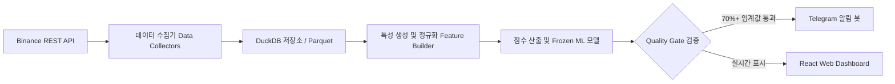

# 🪙 DAO VANG — PeakPulse AI

[](#)

[🇻🇳 Tiếng Việt](README.md) | [🇬🇧 English](README.en.md) | [🇨🇳 简体中文](README.zh-CN.md) | [🇷🇺 Русский](README.ru.md) | [🇰🇷 한국어](README.ko.md)

---

> **DAO VANG — 머신러닝 기반 암호화폐 분매/고점 감지 레이더 (Distribution Radar)**  
> *머신러닝과 실시간 선물 데이터(Binance USD-M Futures)를 활용한 암호화폐 선물 시장 고점 형성 및 분매 단계(Top Formation / Distribution Phase) 조기 경보 시스템.*

---

## 🎯 1. 개요 및 소개

**DAO VANG (골드 마이너)**는 실시간 선물 데이터(Point-in-Time Derivatives Data)를 기반으로 암호화폐 시장의 가격 분매 및 고점 형성 신호(Distribution Phase / Pump & Dump)를 조기에 감지하고 경보하는 분석 플랫폼입니다.

가격과 거래량(OHLCV)에만 의존하는 기존 기술적 분석 도구와 달리, **DAO VANG**은 자금 흐름 지표(펀딩비 Funding Rate, 미결제약정 Open Interest, 테이커 매수/매도 비율 Taker Buy/Sell Ratio, 롱/숏 계정 및 포지션 비율)와 **Walk-Forward 검증을 거친 머신러닝 모델**을 결합하여 신뢰도 높은 분매 확률을 제공합니다.

> 💡 **운영 철학:** 본 시스템은 **수동 경보 레이더 (Human-in-the-loop)**로 작동합니다. DAO VANG은 **자동 매매를 수행하지 않으며 (No Auto-Trading)**, 모든 투자 결정은 100% 사용자의 판단에 맡깁니다.

---

## ✨ 2. 주요 기능

- 🔍 **24/7 실시간 스캐너 (Live Scanner Daemon):** 5분 봉 주기마다 수백 개의 Binance Futures 거래 쌍을 실시간으로 자동 스캔합니다.
- 📊 **Candidate Filter v2 & Pump Filter 메커니즘:** 변동성이 큰 코인을 빠르게 필터링하여 자금 흐름 이상 및 급격한 반전 위험을 감지합니다.
- 🤖 **머신러닝 및 자가 학습 데몬 (Self-Learning Daemon):**
  - 라이브 데이터를 기반으로 모델 자동 교정(Calibration) 및 지속적 자가 학습 수행.
  - **Walk-Forward Validation** 방식을 적용하여 미래 데이터 누수 차단(Zero Data Leakage / Look-ahead Bias 없음).
- 📲 **Telegram 24/7 실시간 알림:** 상세 분석 지표 및 대시보드 직행 링크가 포함된 신호 알림을 개인/그룹 텔레그램으로 즉시 전송합니다.
- 💻 **웹 대시보드 UI (React + Vite + TypeScript):**
  - 트레이딩뷰 스타일의 인터랙티브 캔들차트.
  - 실시간 신호 피드 요약 테이블 (Signal Feed).
  - 시스템 상태 모니터링, 백테스트 이력 조회 및 와치리스트 관리.
- 🐳 **Docker 원클릭 배포:** VPS/서버 환경에서 Docker & Docker Compose를 통해 1클릭 배포 지원.

---

## 🛠 3. 기술 아키텍처 (TECH STACK)

### 🔹 백엔드 및 데이터 엔진 (Python)
- **Core Framework:** Python 3.11+, Pydantic v2, Typer (CLI).
- **Web & API Server:** FastAPI, Uvicorn (RESTful APIs).
- **Data Engine & Storage:** DuckDB (초고속 분석형 데이터 쿼리 엔진), Apache Parquet, Pandas.
- **Logging & Security:** `structlog` 기반 민감 정보 자동 마스킹 처리 (`redact_secrets`).

### 🔹 프론트엔드 (Web Dashboard)
- **Framework:** React 18, TypeScript, Vite.
- **Styling & UI:** Modern Vanilla CSS (Clean & Responsive).
- **Charts:** Lightweight Candlestick Charts & 실시간 데이터 피드.

### 🔹 머신러닝 및 신호 처리
- **Validation Engine:** Walk-Forward Splitter, Event-based Validation, Out-of-fold Calibration.
- **Model Storage:** Frozen Model Bundles (해시 검증 메타데이터 및 설정).

---

## 🔄 4. 작동 프로세스 (PIPELINE)



1. **데이터 수집 (Collect):** Binance USD-M Futures의 5m OHLCV, 미결제약정(OI), 펀딩비(Funding Rate), 테이커 볼륨 및 롱/숏 비율 수집.
2. **정규화 및 As-of Join:** 타임스탬프 기준 데이터 정밀 정렬(Point-in-Time), **미래 데이터 참조 오류 완전 차단 (Zero Lookahead Bias)**.
3. **특성 공학 (Feature Engineering):** 자금 흐름 변동성, OI 대 가격 변화율 비율, 테이커 매수/매도 모멘텀 계산.
4. **추론 및 알림 (Inference & Alert):** Frozen ML 모델을 통해 분매 확률 계산, 쿨다운(Cooldown) 상태 확인 후 Telegram 및 대시보드로 알림 전송.

---

## 🔒 5. 보안 및 개인정보 보호 (SECURITY & PRIVACY)

- **Git 민감 정보 노출 방지:** Telegram Bot Token 등이 포함된 `.env` 파일은 `.gitignore`에 의해 완전 제외됨.
- **로그 마스킹:** 로그 파일 기록 전 민감 키워드(`api_key`, `secret`, `password`, `token`) 자동 마스킹.
- **공개 API 사용:** 바이낸스 공개 API(Public Endpoints)만 사용하므로 개인 API Key 노출 위험 없음.

---

## 🚀 6. 빠른 시작 (QUICK START)

### 환경 설정
```bash
# 리포지토리 클론
git clone https://github.com/mrcanlaco/dao_vang.git
cd dao_vang

# uv / pip를 통한 패키지 설치
pip install -e .
```

### Docker Compose로 스캐너 및 Web UI 실행
```bash
# 템플릿에서 설정 파일 생성
cp .env.docker.example .env.docker

# 전체 시스템 실행 (Scanner + API Server + Frontend)
docker-compose up -d
```

---

*본 프로젝트는 현대 소프트웨어 공학 표준을 엄격히 준수하여 설계되었습니다: Point-in-time Correctness, 모듈화 아키텍처 및 엄격한 데이터 품질 관리.*
