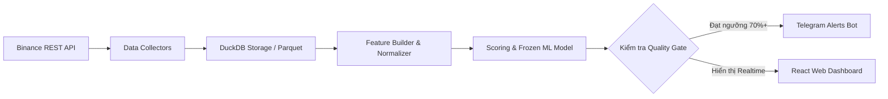

# 🪙 DAO VANG — PeakPulse AI

> **Đảo Vàng — Machine Learning Distribution Radar**  
> *Hệ thống cảnh báo sớm và dự báo giai đoạn Phân phối (Distribution / Top Formation) trên thị trường Tiền mã hóa Phái sinh (Binance USD-M Futures) bằng Máy học.*

---

## 🎯 1. GIỚI THIỆU TỔNG QUAN

**Đảo Vàng** là một nền tảng phân tích và cảnh báo sớm các dấu hiệu tạo đỉnh/phân phối giá (Distribution Phase / Pump & Dump) của thị trường Crypto dựa trên dữ liệu phái sinh thời gian thực (Point-in-Time Derivatives Data).

Khác với các công cụ phân tích kỹ thuật truyền thống chỉ dựa vào giá (OHLCV), **Đảo Vàng** kết hợp dữ liệu hành vi dòng tiền sâu (Funding Rate, Open Interest, Taker Buy/Sell Ratio, Long/Short Account & Position Ratios) và mô hình **Machine Learning (Walk-Forward Validated)** để đưa ra đánh giá xác suất phân phối đáng tin cậy.

> 💡 **Triết lý vận hành:** Hệ thống hoạt động như một **Radar cảnh báo tín hiệu tĩnh** (Human-in-the-loop). Đảo Vàng **KHÔNG tự động đặt lệnh (No Auto-Trading)**, toàn bộ quyết định giao dịch hoàn toàn thuộc về người dùng.

---

## ✨ 2. CÁC TÍNH NĂNG NỔI BẬT

- 🔍 **Live Scanner Daemon (24/7):** Tự động quét theo thời gian thực hàng trăm cặp giao dịch Binance Futures theo chu kỳ nến 5 phút.
- 📊 **Cơ chế Candidate Filter v2 & Pump Filter:** Lọc danh sách coin biến động mạnh, phát hiện bất thường dòng tiền và nguy cơ đảo chiều nhanh chóng.
- 🤖 **Machine Learning & Self-Learning Daemon:**
  - Mô hình tự động căn chỉnh (Calibration) và học hỏi liên tục từ dữ liệu live theo chu kỳ.
  - Đánh giá mô hình nghiêm ngặt bằng phương pháp **Walk-Forward Validation** (Không nhìn trước tương lai / Zero Data Leakage).
- 📲 **Cảnh báo Telegram 24/7:** Gửi thông báo tín hiệu trực tiếp về Telegram cá nhân/group với đầy đủ chỉ số phân tích và đường dẫn mở thẳng coin trên Dashboard.
- 💻 **Giao diện Web Dashboard (React + Vite + TypeScript):**
  - Biểu đồ nến tương tác (Candlestick Chart) chuẩn Trading.
  - Bảng tổng hợp tín hiệu thời gian thực (Signal Feed).
  - Trạng thái sức khỏe hệ thống, lịch sử backtest & theo dõi watchlist linh hoạt.
- 🐳 **Đóng gói Docker Ready:** Sẵn sàng triển khai 1-click bằng Docker & Docker Compose trên VPS/Server.

---

## 🛠 3. KIẾN TRÚC KỸ THUẬT (TECH STACK)

### 🔹 Backend & Data Engine (Python)
- **Core Framework:** Python 3.11+, Pydantic v2, Typer (CLI).
- **Web & API Server:** FastAPI, Uvicorn (RESTful APIs).
- **Data Engine & Storage:** DuckDB (Query engine phân tích dữ liệu siêu tốc), Apache Parquet, Pandas.
- **Logging & Security:** `structlog` tích hợp cơ chế tự động ẩn secret/key (`redact_secrets`).

### 🔹 Frontend (Web Dashboard)
- **Framework:** React 18, TypeScript, Vite.
- **Styling & UI:** Modern Vanilla CSS (Clean & Responsive).
- **Charts:** Lightweight Candlestick Charts & Real-time Feeds.

### 🔹 Machine Learning & Signal Processing
- **Validation Engine:** Walk-Forward Splitter, Event-based Validation, Out-of-fold Calibration.
- **Model Storage:** Frozen Model Bundles (Hash-verified metadata & config).

---

## 🔄 4. CƠ CHẾ HOẠT ĐỘNG (PIPELINE)



1. **Thu thập dữ liệu (Collect):** Quét nến OHLCV 5m, Open Interest, Funding Rate, Taker Volume và Long/Short Ratio từ Binance USD-M Futures.
2. **Chuẩn hóa (Normalize & As-of Join):** Khớp nối dữ liệu chính xác theo mốc thời gian (Point-in-Time), cam kết **Zero Lookahead Bias**.
3. **Trích xuất Đặc trưng (Feature Engineering):** Tính toán các chỉ số biến động dòng tiền, tỷ lệ biến động OI vs Price, lực mua/bán Taker chủ động.
4. **Suy luận & Cảnh báo (Inference & Alert):** Đưa qua mô hình Frozen ML để tính toán xác suất phân phối, kiểm tra Cooldown và đẩy cảnh báo đến Telegram & Dashboard.

---

## 🔒 5. AN TOÀN & BẢO MẬT (SECURITY & PRIVACY)

- **Không lưu trữ Secret/Token trong Git:** File `.env` chứa Telegram Bot Token được chặn hoàn toàn bởi `.gitignore`.
- **An toàn Log:** Tự động lọc các từ khóa nhạy cảm (`api_key`, `secret`, `password`, `token`) trước khi ghi file log.
- **Public API Ready:** Không yêu cầu Binance API Secret để quét (dùng public endpoints), hạn chế tối đa rủi ro lộ khóa API giao dịch.

---

## 🚀 6. HƯỚNG DẪN KHỞI CHẠY NHANH (QUICK START)

### Cài đặt môi trường
```bash
# Clone dự án
git clone https://github.com/mrcanlaco/dao_vang.git
cd dao_vang

# Cài đặt thư viện bằng uv / pip
pip install -e .
```

### Chạy Scanner & Web UI bằng Docker Compose
```bash
# Tạo file cấu hình từ template
cp .env.docker.example .env.docker

# Khởi chạy toàn bộ hệ thống (Scanner + API Server + Frontend)
docker-compose up -d
```

---

*Dự án được thiết kế chuẩn mực theo nguyên tắc kỹ nghệ phần mềm hiện đại: Point-in-time Correctness, Modular Architecture và Strict Data Quality.*
