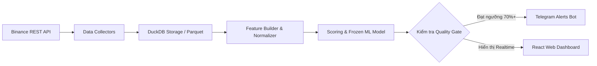

# 🪙 DAO VANG — PeakPulse AI

[](LICENSE)
[](#)

[🇻🇳 Tiếng Việt](README.md) | [🇬🇧 English](README.en.md) | [🇨🇳 简体中文](README.zh-CN.md) | [🇷🇺 Русский](README.ru.md) | [🇰🇷 한국어](README.ko.md)

---

> **Đảo Vàng — Machine Learning Distribution Radar**  
> *Hệ thống cảnh báo sớm và dự báo giai đoạn Phân phối (Distribution / Top Formation) trên thị trường Tiền mã hóa Phái sinh (Binance USD-M Futures) bằng Máy học.*

---

## 🎯 1. GIỚI THIỆU TỔNG QUAN

**Đảo Vàng** là một nền tảng phân tích và cảnh báo sớm các dấu hiệu tạo đỉnh/phân phối giá (Distribution Phase / Pump & Dump) của thị trường Crypto dựa trên dữ liệu phái sinh thời gian thực (Point-in-Time Derivatives Data).

Khác với các công cụ phân tích kỹ thuật truyền thống chỉ dựa vào giá (OHLCV), **Đảo Vàng** kết hợp dữ liệu hành vi dòng tiền sâu (Funding Rate, Open Interest, Taker Buy/Sell Ratio, Long/Short Account & Position Ratios) và mô hình **Machine Learning (Walk-Forward Validated)** để đưa ra đánh giá xác suất phân phối đáng tin cậy.

> 💡 **Triết lý vận hành:** Hệ thống hoạt động như một **Radar cảnh báo tín hiệu tĩnh** (Human-in-the-loop). Đảo Vàng **KHÔNG tự động đặt lệnh (No Auto-Trading)**, toàn bộ quyết định giao dịch hoàn toàn thuộc về người dùng.

---

## 🏆 2. THÀNH TỰU & NĂNG LỰC ĐỊNH LƯỢNG THỰC TIỄN (QUANTITATIVE TRACK RECORD)

Hệ thống được xây dựng và kiểm định dựa trên các tiêu chuẩn định lượng khắt khe trong kỹ nghệ tài chính (Quantitative Finance & MLOps):

### 📊 Bảng Chỉ Số Thực Nghiệm (Walk-Forward Validation Benchmarks)

| Chỉ số Định lượng (Metric) | Kết quả Đạt được | Ý nghĩa Thực tiễn |
| :--- | :---: | :--- |
| **Dữ liệu Kiểm định (Validation Samples)** | **600,000+ nến 5m** | Kiểm định xuyên suốt >92 ngày giao dịch phái sinh thực tế. |
| **Thời gian Cảnh báo Sớm (Median Lead Time)** | **~9.8 Giờ** *(590 phút)* | Báo trước trung bình ~9.8h trước khi coin sụt giảm ≥8%, đủ thời gian phân tích kỹ. |
| **Độ Bắt Sóng Phân Phối (Event Recall)** | **~60.1%** | Nhận diện thành công phần lớn các pha phân phối đỉnh lớn. |
| **Chỉ số Hiệu chuẩn Sai số (Brier Score)** | **0.113** *(Rất thấp)* | Xác suất dự báo trung thực, tiệm cận tần suất xuất hiện thực tế của thị trường. |
| **Khả năng Chống Nhìn Trước (Data Leakage)** | **100% Zero Leakage** | Walk-Forward Splitter kết hợp Embargo Window và Point-in-Time As-of Joins. |

### 🔍 Điểm Nổi Bật Về Mặt Kỹ Nghệ
- 📈 **Mục Tiêu Định Lượng Chuẩn Xác (Strict Ground-Truth Labeling):**
  - Nhận diện chính xác các pha phân phối đỉnh dẫn tới mức sụt giảm **≥ 8%** trong khung 6h, 12h hoặc 24h, đồng thời khống chế mức tăng ngược (Maximum Adverse Excursion - MAE) **không vượt quá 4%**.
- 🛡️ **Kiểm Định Đa Chế Độ Thị Trường (Regime Breakdown):**
  - Mô hình được kiểm tra độc lập và chứng minh hiệu quả qua cả 3 trạng thái: **Bull Market (Thị trường Tăng)**, **Bear Market (Thị trường Giảm)** và **Sideway (Thị trường Đi ngang)**.
- 🎯 **Hiệu Chuẩn Xác Suất Đáng Tin Cậy (Calibrated ML Probability):**
  - Tích hợp **Isotonic & Out-of-fold Calibration** giúp xác suất mô hình phản ánh đúng tần suất thực tế của thị trường (ECE ≤ 0.05), không nói quá hoặc thổi phồng tín hiệu.
- ⚡ **Xử Lý Dữ Liệu Phái Sinh Đa Chiều Tốc Độ Cao:**
  - Tích hợp động cơ **DuckDB Columnar Analytics**, quét và phân tích đồng thời 150+ cặp coin Binance Futures với độ trễ tính toán dưới 1 giây.
- 🔄 **Hệ Thống Tự Học & Đánh Giá Hậu Kiểm (Feedback Loop & PnL Tracking):**
  - Tự động ghi nhận và hậu kiểm kết quả (*Outcome Resolution*) của từng tín hiệu sau khi phát ra, cung cấp độ chính xác lịch sử thực nghiệm (*Empirical Precision*) ngay trong từng bản tin Telegram.

---

## ✨ 3. CÁC TÍNH NĂNG NỔI BẬT

- 🔍 **Live Scanner Daemon (24/7):** Tự động quét theo thời gian thực hàng trăm cặp giao dịch Binance Futures theo chu kỳ nến 5 phút.
- 📊 **Cơ chế Candidate Filter v2 & Pump Filter:** Lọc danh sách coin biến động mạnh, phát hiện bất thường dòng tiền và nguy cơ đảo chiều nhanh chóng.
- 🚨 **Market Anomaly Radar:** Gắn nhãn độc lập cho đột biến khối lượng, funding cực trị/đổi dấu, đảo chiều, OI unwind, đòn bẩy tích tụ, taker sell imbalance, long/short crowding và phá vỡ giả; điểm anomaly 0-100 chỉ là quan sát, không phải xác suất model.
- 🤖 **Machine Learning & Self-Learning Daemon:**
  - Pipeline huấn luyện hỗ trợ calibration; live alert chỉ bật khi bundle có calibration artifact hợp lệ.
  - Đánh giá mô hình nghiêm ngặt bằng phương pháp **Walk-Forward Validation** (Không nhìn trước tương lai / Zero Data Leakage).
- 📲 **Cảnh báo Telegram 24/7:** Gửi thông báo tín hiệu trực tiếp về Telegram cá nhân/group với đầy đủ chỉ số phân tích và đường dẫn mở thẳng coin trên Dashboard.
- 💻 **Giao diện Web Dashboard (React + Vite + TypeScript):**
  - Biểu đồ nến tương tác (Candlestick Chart) chuẩn Trading.
  - Bảng tổng hợp tín hiệu thời gian thực (Signal Feed).
  - Trạng thái sức khỏe hệ thống, lịch sử backtest & theo dõi watchlist linh hoạt.
- 🐳 **Đóng gói Docker Ready:** Sẵn sàng triển khai 1-click bằng Docker & Docker Compose trên VPS/Server.

---

## 🛠 4. KIẾN TRÚC KỸ THUẬT (TECH STACK)

### 🔹 Backend & Data Engine (Python)
- **Core Framework:** Python 3.12, Pydantic v2, Typer (CLI).
- **Web & API Server:** `ThreadingHTTPServer` + REST endpoints; frontend hiện refresh dữ liệu theo chu kỳ.
- **Data Engine & Storage:** DuckDB (Query engine phân tích dữ liệu siêu tốc), Apache Parquet, Pandas.
- **Logging & Security:** `structlog` tích hợp cơ chế tự động ẩn secret/key (`redact_secrets`).

### 🔹 Frontend (Web Dashboard)
- **Framework:** React 19, TypeScript, Vite.
- **Styling & UI:** Modern Vanilla CSS (Clean & Responsive).
- **Charts:** Lightweight Candlestick Charts & polling-based live snapshots.

### 🔹 Machine Learning & Signal Processing
- **Validation Engine:** Walk-Forward Splitter, Event-based Validation, Out-of-fold Calibration.
- **Model Storage:** Frozen Model Bundles (Hash-verified metadata & config).

---

## 🔄 5. CƠ CHẾ HOẠT ĐỘNG (PIPELINE)



1. **Thu thập dữ liệu (Collect):** Quét nến OHLCV 5m, Open Interest, Funding Rate, Taker Volume và Long/Short Ratio từ Binance USD-M Futures.
2. **Chuẩn hóa (Normalize & As-of Join):** Khớp nối dữ liệu chính xác theo mốc thời gian (Point-in-Time), cam kết **Zero Lookahead Bias**.
3. **Trích xuất Đặc trưng (Feature Engineering):** Tính toán các chỉ số biến động dòng tiền, tỷ lệ biến động OI vs Price, lực mua/bán Taker chủ động.
4. **Suy luận & Cảnh báo (Inference & Alert):** Đưa qua mô hình Frozen ML để tính toán xác suất phân phối; đồng thời chạy lớp Market Anomaly Radar độc lập, lưu snapshot và hiển thị các quan sát trên Dashboard. Telegram vẫn chỉ gửi các tín hiệu vượt qua serving contract và quality gate.

📖 *Xem chi tiết tại:* [**Tài liệu Kiến trúc Toàn diện (docs/ARCHITECTURE.md)**](docs/ARCHITECTURE.md)

---

## 📂 6. CẤU TRÚC THƯ MỤC DỰ ÁN (PROJECT DIRECTORY MAP)

```
dao_vang/
├── configs/            # File cấu hình mẫu (default.example.yaml, live.yaml)
├── docs/               # Trung tâm tài liệu (Architecture, Developer Guide, ADRs, Setup)
│   ├── adr/            # Architecture Decision Records (ADR-001 đến ADR-007)
│   ├── ARCHITECTURE.md # Sơ đồ kiến trúc & luồng dữ liệu chi tiết
│   ├── DEVELOPER_GUIDE.md # Hướng dẫn viết code, thêm collector, feature, scoring
│   └── ...
├── frontend/           # Ứng dụng Web Dashboard (React 19 + Vite + TypeScript)
│   └── src/components/ # Các component giao diện (MainWorkspace, SignalFeed, AlphaLab...)
├── scripts/            # Script vận hành, supervisor tự khởi động lại, dev_check.py
├── src/dao_vang/       # Toàn bộ mã nguồn cốt lõi Backend (Modular Monolith)
│   ├── alerts/         # Telegram alert engine & định dạng bản tin song ngữ
│   ├── alpha_lab/      # Nghiên cứu định lượng (Triple barrier, Meta labeling, Regime)
│   ├── baselines/      # Mô hình đối chuẩn (Rule-based & Logistic regression)
│   ├── cli/            # Giao diện dòng lệnh Typer (`dao-vang`)
│   ├── config/         # Quản lý cấu hình Pydantic v2
│   ├── data/           # Binance collectors, schemas, DuckDB & Parquet storage
│   ├── domain/         # Domain entities, enums, error models & time helpers
│   ├── experiments/    # Experiment runner, self-learning feedback & forward test
│   ├── features/       # Feature registry & point-in-time feature builders
│   ├── labels/         # Ground truth labeling engine (sụt giảm 8% trong 6-24h)
│   ├── logging/        # Structured logging với cơ chế tự động ẩn secret
│   ├── scanner/        # 24/7 Live Scanner Daemon, Pump Filter, Watchlist tracker
│   ├── scoring/        # Frozen ML inference, BTC context & evidence scoring
│   ├── validation/     # Walk-forward validation, zero leakage audit & metrics
│   └── web/            # Threaded REST API & static frontend server
└── tests/              # 375+ bài kiểm thử tự động (Unit, Integration, Leakage, QA)
```

---

## 🔒 7. AN TOÀN & BẢO MẬT (SECURITY & PRIVACY)

- **Không lưu trữ Secret/Token trong Git:** File `.env` chứa Telegram Bot Token được chặn hoàn toàn bởi `.gitignore`.
- **An toàn Log:** Tự động lọc các từ khóa nhạy cảm (`api_key`, `secret`, `password`, `token`) trước khi ghi file log.
- **Public API Ready:** Không yêu cầu Binance API Secret để quét (dùng public endpoints), hạn chế tối đa rủi ro lộ khóa API giao dịch.

---

## 🚀 7. HƯỚNG DẪN KHỞI CHẠY (RUNNING GUIDE)

Hệ thống được thiết kế tách biệt hoàn toàn giữa **Môi trường Phát triển (Dev)** và **Môi trường Vận hành Thực tế (Live)** để đảm bảo an toàn dữ liệu và tối ưu hiệu năng.

```
┌─────────────────────────┬──────────────────────────┬─────────────────────────┐
│ Tiêu chí                │ Môi trường DEV           │ Môi trường LIVE         │
├─────────────────────────┼──────────────────────────┼─────────────────────────┤
│ Mục đích                │ Code tính năng, thử UI   │ Chạy 24/7 quét thị trường│
│ Cổng mặc định (Port)    │ Backend 8000 / Vite 5173 │ Web API 8001            │
│ Thư mục dữ liệu (Data)  │ data/ (data/dev.duckdb)  │ data_live/ (live.duckdb)│
│ Hot-Reload              │ Bật (Frontend & Backend) │ Tắt (Tối ưu hiệu năng)  │
└─────────────────────────┴──────────────────────────┴─────────────────────────┘
```

---

### 💻 A. HƯỚNG DẪN CHẠY BẢN DEV (DEVELOPMENT MODE)

Dành cho nhà phát triển muốn đóng góp code, chỉnh sửa mô hình Machine Learning hoặc tùy biến giao diện React.

#### 1. Cài đặt môi trường ban đầu
```bash
# Clone repository
git clone https://github.com/mrcanlaco/Dao-Vang-Peak-Pulse.git
cd Dao-Vang-Peak-Pulse

# Tạo môi trường ảo Python và cài đặt dependencies
python -m venv .venv
source .venv/bin/activate  # Trên Windows: .\.venv\Scripts\activate
pip install -e .

# Cài đặt dependencies cho Frontend
cd frontend && npm install && cd ..
```

#### 2. Khởi chạy với Hot-Reload (2 Terminal)
- **Terminal 1 — Backend Web API & Scanner Daemon:**
  ```bash
  python -m dao_vang.web.run --reload --port 8000
  ```
- **Terminal 2 — Frontend React + Vite:**
  ```bash
  cd frontend
  npm run dev
  ```
  👉 Mở trình duyệt tại: `http://localhost:5173` *(Vite sẽ tự động proxy các request API sang port 8000)*.

#### 3. Khởi chạy nhanh 1-Click trên Windows (Dev)
- Nhấp đúp file `run_dev.bat` để chạy Web Server Dev.
- (Tùy chọn) Nhấp đúp `run_scanner_dev.bat` để chạy tiến trình quét liên tục trên môi trường dev.

---

### 🌐 B. HƯỚNG DẪN CHẠY BẢN LIVE (PRODUCTION / 24/7 LIVE RADAR)

Dành cho việc triển khai máy chủ/VPS thực tế hoặc chạy nền ổn định trên máy tính cá nhân.

#### Cách 1: Triển khai 1-Click bằng Docker Compose (Khuyên dùng cho VPS/Linux)
```bash
# 1. Sao chép và cấu hình file môi trường
cp .env.docker.example .env.docker

# 2. Điền thông tin cấu hình Telegram Bot (nếu muốn nhận thông báo)
# nano .env.docker

# 3. Khởi chạy toàn bộ hệ sinh thái (Scanner Daemon + API + Web Frontend)
docker compose up -d --build

# 4. Kiểm tra trạng thái và logs
docker compose ps
docker compose logs -f scanner
```
👉 Truy cập Dashboard tại: `http://localhost:8000` *(hoặc qua reverse proxy Nginx của bạn)*.

#### Cách 2: Chạy trực tiếp trên Windows Server / PC (Tích hợp Supervisor tự phục hồi)
- **Khởi động Web Live Dashboard:**
  Nhấp đúp hoặc chạy file `run_live.bat`  
  *(Tự động kích hoạt supervisor giám sát port `8001`, tự khởi động lại nếu có lỗi và ghi log xoay vòng tại `scripts/logs/web_live.log`)*.
- **Khởi động Live Scanner Daemon:**
  Nhấp đúp hoặc chạy file `run_scanner_live.bat`  
  *(Quét liên tục chu kỳ 5 phút hàng trăm mã Binance Futures, phân tích dòng tiền và đẩy cảnh báo đến Telegram)*.

#### Cách 3: Chạy trực tiếp bằng CLI trên Linux / Mac
```bash
# 1. Build bundle Frontend tĩnh
cd frontend && npm run build && cd ..

# 2. Khởi chạy Server Live với database riêng biệt data_live
export DAO_VANG_WEB__PORT=8001
export DAO_VANG_PATHS__DATA_DIR=data_live
export DAO_VANG_SCANNER__DB_PATH=data_live/live.duckdb

python -m dao_vang.web.run 8001
```

---

### 🧪 C. KIỂM THỬ VÀ KIỂM TRA CHẤT LƯỢNG MÃ NGUỒN (TESTING & QA)

Để kiểm tra toàn bộ chất lượng mã nguồn trước khi commit hoặc mở Pull Request:

```bash
# Chạy 1 lệnh kiểm tra toàn diện (Linter + Typecheck + Backend Tests + Frontend Build + Tự dọn rác)
python scripts/dev_check.py

# Hoặc chạy kiểm tra nhanh chỉ unit tests:
python scripts/dev_check.py --fast

# Hoặc chạy từng công cụ độc lập:
uv run ruff check .          # Linter & Formatter
uv run pyright               # Type Checking
.\.venv\Scripts\pytest.exe   # 375+ bài kiểm thử backend
cd frontend && npm run build # Frontend TypeScript build
```

---

## 🗺 9. LỘ TRÌNH PHÁT TRIỂN (ROADMAP)

- [ ] 🔌 **Đa sàn giao dịch (Multi-Exchange):** Mở rộng thu thập dữ liệu phái sinh từ Bybit, OKX Futures.
- [ ] 🤖 **Nâng cấp Mô hình ML:** Thử nghiệm & tích hợp LightGBM, CatBoost và Sequential Models.
- [ ] ⚡ **Real-time WebSocket Streaming:** Nâng cấp kênh thu thập dữ liệu sang WebSocket thời gian thực.
- [ ] 📱 **Telegram Mini-App:** Tích hợp Web Dashboard trực tiếp trong Telegram bot.

---

## 🤝 10. ĐÓNG GÓP CỘNG ĐỒNG (CONTRIBUTING)

Dự án hoan nghênh mọi sự đóng góp từ cộng đồng nhà phát triển và trader toàn cầu:
- 📖 Hướng dẫn chi tiết cho Contributor: [**docs/DEVELOPER_GUIDE.md**](docs/DEVELOPER_GUIDE.md)
- 🤝 Quy chuẩn đóng góp & quy trình PR: [**CONTRIBUTING.md**](CONTRIBUTING.md)
- 🛡 Quy tắc ứng xử cộng đồng: [**CODE_OF_CONDUCT.md**](CODE_OF_CONDUCT.md)
- 🔒 Chính sách báo cáo an toàn: [**SECURITY.md**](SECURITY.md)

---

*Dự án được thiết kế chuẩn mực theo nguyên tắc kỹ nghệ phần mềm hiện đại: Point-in-time Correctness, Modular Architecture và Strict Data Quality.*
