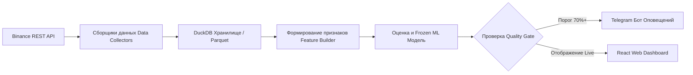

# 🪙 DAO VANG — PeakPulse AI

[](LICENSE)
[](#)

[🇻🇳 Tiếng Việt](README.md) | [🇬🇧 English](README.en.md) | [🇨🇳 简体中文](README.zh-CN.md) | [🇷🇺 Русский](README.ru.md) | [🇰🇷 한국어](README.ko.md)

---

> **DAO VANG — Радар распределения и раннего обнаружения вершин рынка на основе ML**  
> *Система раннего оповещения и прогнозирования фазы распределения (Distribution Phase / Top Formation) на рынке криптовалютных деривативов (Binance USD-M Futures) с использованием машинного обучения.*

---

## 🎯 1. ОБЗОР И ВВЕДЕНИЕ

**DAO VANG (Золотоискатель)** — это аналитическая платформа для раннего выявления сигналов формирования вершины и фазы распределения цен (Distribution Phase / Pump & Dump) на крипторынке на основе деривативных данных в режиме реального времени (Point-in-Time Derivatives Data).

В отличие от традиционных инструментов технического анализа, опирающихся только на цену и объем (OHLCV), **DAO VANG** сочетает метрики движения капитала (Funding Rate, Open Interest, Taker Buy/Sell Ratio, соотношение длинных и коротких позиций/аккаунтов) с **моделью машинного обучения (Walk-Forward Validated)** для получения высоконадежных оценок вероятности распределения.

> 💡 **Философия работы:** Система работает как **пассивный радар оповещений** (Human-in-the-loop). DAO VANG **НЕ совершает автоматических сделок (No Auto-Trading)**; все торговые решения принимаются исключительно пользователем.

---

## ✨ 2. ОСНОВНЫЕ ВОЗМОЖНОСТИ

- 🔍 **Круглосуточный сканер (Live Scanner Daemon 24/7):** Автоматически сканирует сотни торговых пар Binance Futures в режиме реального времени с 5-минутным интервалом K-линий.
- 📊 **Механизмы Candidate Filter v2 & Pump Filter:** Фильтрация высоковолатильных монет, обнаружение аномалий денежных потоков и рисков быстрого разворота.
- 🤖 **Машинное обучение и демон самообучения (Self-Learning Daemon):**
  - Автоматическая калибровка модели и непрерывное обучение на поступающих реальных данных.
  - Строгая оценка модели методом **Walk-Forward Validation** (Без утечки данных из будущего / Zero Data Leakage).
- 📲 **Уведомления в Telegram 24/7:** Мгновенная отправка сигналов в личные сообщения или группы Telegram с полными аналитическими метриками и прямыми ссылками на дашборд.
- 💻 **Веб-интерфейс Dashboard (React + Vite + TypeScript):**
  - Интерактивный график свечей (стиль TradingView).
  - Сводная таблица сигналов в реальном времени (Signal Feed).
  - Мониторинг состояния системы, история бэктестов и гибкий список наблюдения (Watchlist).
- 🐳 **Готовность к Docker:** Быстрый запуск в 1 клик с помощью Docker & Docker Compose на VPS/сервере.

---

## 🛠 3. ТЕХНИЧЕСКАЯ АРХИТЕКТУРА (TECH STACK)

### 🔹 Бэкенд и движок данных (Python)
- **Основной фреймворк:** Python 3.11+, Pydantic v2, Typer (CLI).
- **Веб и API сервер:** FastAPI, Uvicorn (RESTful APIs).
- **Движок данных и хранилище:** DuckDB (сверхбыстрый аналитический движок запросов), Apache Parquet, Pandas.
- **Логирование и безопасность:** `structlog` с автоматической маскировкой конфиденциальных данных (`redact_secrets`).

### 🔹 Фронтенд (Web Dashboard)
- **Фреймворк:** React 18, TypeScript, Vite.
- **Стили и UI:** Modern Vanilla CSS (чистый и адаптивный).
- **Графики:** Lightweight Candlestick Charts & потоки данных в реальном времени.

### 🔹 Машинное обучение и обработка сигналов
- **Движок валидации:** Walk-Forward Splitter, Event-based Validation, Out-of-fold Calibration.
- **Хранение моделей:** Frozen Model Bundles (проверка хеша метаданных и конфигураций).

---

## 🔄 4. ПРИНЦИП РАБОТЫ (PIPELINE)



1. **Сбор данных (Collect):** Сбор 5м OHLCV свечей, открытого интереса (OI), ставки финансирования (Funding Rate), объема Taker и соотношения Long/Short с Binance USD-M Futures.
2. **Нормализация и As-of Join:** Точная синхронизация данных по метке времени (Point-in-Time) со **100% отсутствием заглядывания в будущее (Zero Lookahead Bias)**.
3. **Генерация признаков (Feature Engineering):** Расчет динамики денежных потоков, соотношения OI к цене и активности покупок/продаж Taker.
4. **Инференс и Оповещение (Inference & Alert):** Передача признаков в модель Frozen ML для расчета вероятности распределения, проверка таймаута (Cooldown) и отправка уведомлений в Telegram и на дашборд.

---

## 🔒 5. БЕЗОПАСНОСТЬ И КОНФИДЕНЦИАЛЬНОСТЬ

- **Без ключей в Git:** Файл `.env` с ключами (например, Telegram Bot Token) полностью исключен через `.gitignore`.
- **Очистка логов:** Автоматическая маскировка конфиденциальных ключевых слов (`api_key`, `secret`, `password`, `token`) перед записью в лог-файлы.
- **Безопасность API:** Не требуются приватные ключи Binance API (используются только публичные эндпоинты).

---

## 🚀 6. БЫСТРЫЙ ЗАПУСК (QUICK START)

### Настройка окружения
```bash
# Клонирование репозитория
git clone https://github.com/mrcanlaco/dao_vang.git
cd dao_vang

# Установка зависимостей с помощью uv / pip
pip install -e .
```

### Запуск сканера и Web UI через Docker Compose
```bash
# Создание конфигурационного файла из шаблона
cp .env.docker.example .env.docker

# Запуск всей системы (Scanner + API Server + Frontend)
docker-compose up -d
```

---

*Проект разработан в соответствии с современными стандартами инженерии ПО: Point-in-time Correctness, модульная архитектура и строгий контроль качества данных.*
