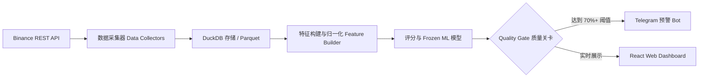

# 🪙 DAO VANG — PeakPulse AI

[](LICENSE)
[](#)

[🇻🇳 Tiếng Việt](README.md) | [🇬🇧 English](README.en.md) | [🇨🇳 简体中文](README.zh-CN.md) | [🇷🇺 Русский](README.ru.md) | [🇰🇷 한국어](README.ko.md)

---

> **DAO VANG — 基于机器学习的加密货币派发/见顶预警系统 (Distribution Radar)**  
> *基于机器学习与实时衍生品数据（Binance USD-M Futures），针对加密货币衍生品市场顶部分析与派发阶段（Top Formation / Distribution Phase）的早期预警系统。*

---

## 🎯 1. 概述与简介

**DAO VANG（淘金者）** 是一个专为加密货币衍生品市场设计的分析与早期预警平台，旨在通过实时衍生品数据（Point-in-Time Derivatives Data）识别价格派发/见顶信号（Distribution Phase / Pump & Dump）。

与仅依赖价格与成交量（OHLCV）的传统技术分析工具不同，**DAO VANG** 结合了深度资金流向指标（资金费率 Funding Rate、持仓量 Open Interest、主动买卖比例 Taker Buy/Sell Ratio、大户/散户持仓与多空账户比）以及经过 **Walk-Forward Validated（前向走查验证）的机器学习模型**，提供高可靠性的见顶派发概率评估。

> 💡 **核心运行理念：** 本系统作为 **被动预警雷达（Human-in-the-loop）** 运行。DAO VANG **不进行自动下单（No Auto-Trading）**，所有交易决策完全由用户自主掌控。

---

## ✨ 2. 核心特性

- 🔍 **全天候实时扫描器 (Live Scanner Daemon 24/7)：** 以 5 分钟 K 线为周期，实时自动扫描数百个 Binance Futures 交易对。
- 📊 **Candidate Filter v2 & Pump Filter 筛选机制：** 快速过滤高波动币种，精准捕捉资金流异常与快速反转风险。
- 🤖 **机器学习与自学习守护进程 (Machine Learning & Self-Learning Daemon)：**
  - 模型根据实时数据定期自动校准（Calibration）与持续学习。
  - 采用严格的 **Walk-Forward Validation（前向走查验证）** 方法（无未来函数 / Zero Data Leakage）。
- 📲 **Telegram 24/7 实时推送：** 将预警信号直接发送至个人/群组 Telegram，附带完整的分析指标与 Dashboard 直达链接。
- 💻 **Web Dashboard 可视化界面 (React + Vite + TypeScript)：**
  - 专业级交互式 K 线图（TradingView 风格）。
  - 实时信号汇总表（Signal Feed）。
  - 系统健康状态监控、历史 Backtest 记录与灵活的 Watchlist 观察列表。
- 🐳 **Docker 快速部署：** 支持 Docker & Docker Compose 一键部署至 VPS/服务器。

---

## 🛠 3. 技术架构 (TECH STACK)

### 🔹 后端与数据引擎 (Python)
- **核心框架：** Python 3.12, Pydantic v2, Typer (CLI)。
- **Web & API 服务：** `ThreadingHTTPServer` REST API 与静态前端服务。
- **数据引擎与存储：** DuckDB（极速分析型数据查询引擎）, Apache Parquet, Pandas。
- **日志与安全：** `structlog` 嵌入敏感信息自动脱敏机制 (`redact_secrets`)。

### 🔹 前端 (Web Dashboard)
- **框架：** React 19, TypeScript, Vite。
- **样式与 UI：** Modern Vanilla CSS（简洁且响应式）。
- **图表：** Lightweight Candlestick Charts & 实时数据流。

### 🔹 机器学习与信号处理
- **验证引擎：** Walk-Forward Splitter, Event-based Validation, Out-of-fold Calibration。
- **模型存储：** Frozen Model Bundles（哈希校验元数据与配置）。

---

## 🔄 4. 运行流程 (PIPELINE)



1. **数据采集 (Collect)：** 采集 Binance USD-M Futures 的 5m OHLCV、持仓量 (OI)、资金费率 (Funding Rate)、Taker 成交量与多空比。
2. **归一化与 As-of Join：** 按时间戳精确对齐数据（Point-in-Time），确保 **零未来函数 (Zero Lookahead Bias)**。
3. **特征工程 (Feature Engineering)：** 计算资金流波动指标、OI 与价格变化率对比、Taker 主动买卖动能。
4. **推理与预警 (Inference & Alert)：** 传入 Frozen ML 模型计算派发概率，检查冷却状态 (Cooldown)，并将预警推送至 Telegram 与 Dashboard。

---

## 🔒 5. 安全与隐私 (SECURITY & PRIVACY)

- **Git 无敏感信息暴露：** 包含 Telegram Bot Token 等敏感信息的 `.env` 文件已被 `.gitignore` 完全屏蔽。
- **日志脱敏：** 在写入日志文件前，自动过滤敏感关键词（`api_key`, `secret`, `password`, `token`）。
- **无需私钥：** 扫描仅使用 Binance 公开 API (Public Endpoints)，无需绑定交易 API Key，最大限度降低安全风险。

---

## 🚀 6. 快速开始 (QUICK START)

### 环境配置
```bash
# 克隆项目仓库
git clone https://github.com/mrcanlaco/Dao-Vang-Peak-Pulse.git
cd Dao-Vang-Peak-Pulse

# 使用 uv / pip 安装依赖
pip install -e .
```

### 使用 Docker Compose 一键启动 Scanner 与 Web UI
```bash
# 从模板创建配置文件
cp .env.docker.example .env.docker

# 启动完整系统 (Scanner + API Server + Frontend)
docker-compose up -d
```

---

*本项目严格遵循现代软件工程规范设计：Point-in-time Correctness（时点正确性）、Modular Architecture（模块化架构）与 Strict Data Quality（严格数据质量）。*
