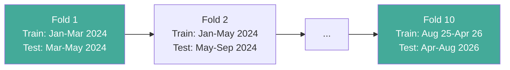
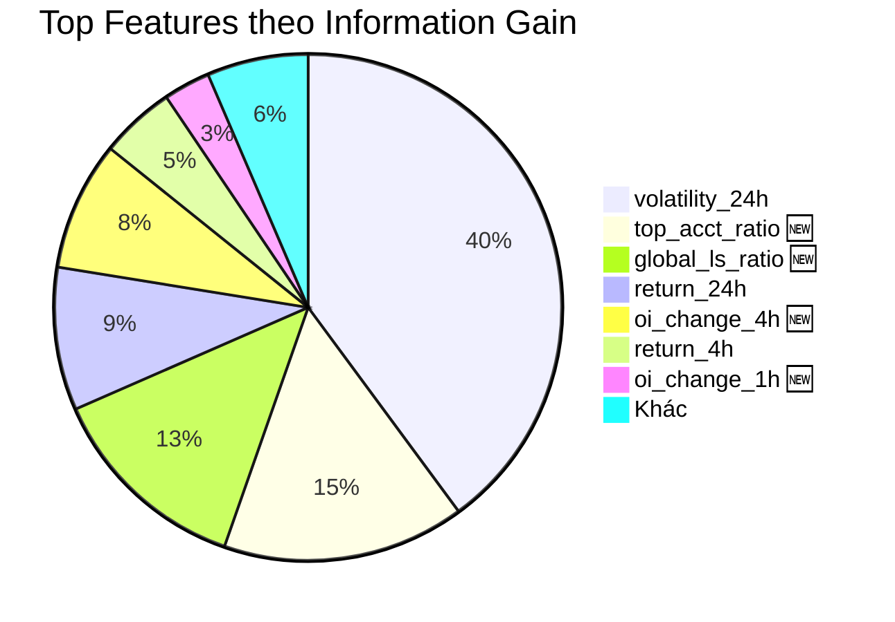

# 📊 Báo Cáo Kiểm Định Model — dao_vang

> **Ngày chạy:** 2026-08-29 23:56 UTC (2026-08-30 06:56 ICT)
> **Người thực hiện:** Antigravity Agent (đã thẩm định & sửa lỗi agent trước)
> **Phiên bản code:** `dao_vang` @ `d:\Coding\dao_vang`
> **Report file:** `artifacts/backtest_report_latest.json`

---

## 1. Mục Tiêu

Kiểm định độ tin cậy của hệ thống phát hiện **Distribution Short** (tín hiệu phân phối đỉnh) trên dữ liệu lịch sử, trả lời 3 câu hỏi:

1. Model có **chính xác** khi phát tín hiệu không? (Precision)
2. Model hoạt động **tốt ở regime nào**? (Regime Analysis)
3. Model có **an toàn** trong các sự kiện biến động lớn không? (Stress Test)

---

## 2. Dữ Liệu Sử Dụng

| Thông tin | Chi tiết |
|-----------|----------|
| **Nguồn** | `D:\Quant-trading\data_lake\quant_master.duckdb` |
| **Khoảng thời gian** | 2024-01-02 → 2026-08-28 (**~2.6 năm**) |
| **Số coin** | **30 coins** (top volume trên Binance Futures) |
| **Tổng rows đánh giá** | **413,845** (sau lọc exhaustion candidates) |
| **Timeframe** | 5 phút (5m) |

### Nguồn dữ liệu chi tiết

| Loại | Nguồn gốc | Độ dài | Ghi chú |
|------|-----------|--------|---------|
| **Klines (OHLCV)** | Binance Futures (đã có sẵn) | 2.6 năm, 327 coins | Đầy đủ |
| **Funding Rate** | Binance REST API `/fapi/v1/fundingRate` | 2.6 năm, 327 coins | Tải mới 29/08 |
| **Metrics** (OI, Ratios) | Binance Vision Archive `data.binance.vision` | 2.6 năm, 327 coins | Tải mới 29/08 |

### Features (14 biến đầu vào)

````carousel
**Nhóm Price (6 features)**
- `return_5m` — biến động giá 5 phút
- `volatility_5m` — biên độ nến 5 phút
- `volatility_24h` — độ lệch chuẩn return 24h (rolling)
- `return_1h` / `return_4h` / `return_24h` — % thay đổi giá
<!-- slide -->
**Nhóm Volume (2 features)**
- `taker_ratio` — tỷ lệ taker buy / tổng volume
- `vol_surge_24h` — volume hiện tại / trung bình 24h
<!-- slide -->
**Nhóm Derivatives (6 features) 🆕**
- `funding_rate_raw` — funding rate gần nhất
- `oi_change_1h` / `oi_change_4h` — % thay đổi Open Interest
- `top_acct_ratio` — tỷ lệ L/S top traders (account)
- `global_ls_ratio` — tỷ lệ L/S toàn sàn
- `taker_bs_ratio` — tỷ lệ taker buy/sell
````

### Label (nhãn mục tiêu)

- **Horizon:** 12 giờ (144 bars × 5m)
- **Điều kiện dương (label=1):** Giá giảm ≥ 8% (drawdown) VÀ không tăng quá 4% (MAE) trong 12h tới
- **Ý nghĩa:** "Đúng là có đợt phân phối xảy ra sau tín hiệu"

---

## 3. Phương Pháp Kiểm Định

### Walk-Forward 10-Fold



- **Expanding window:** Train set mở rộng dần, test set cuốn chiếu về sau
- **Embargo 48h** (576 bars) giữa train và test — tránh data leakage
- **Mỗi fold:** Train LightGBM → Isotonic Calibration → Predict → So sánh với LogReg

### Hai model so sánh

| Model | Vai trò | Đặc điểm |
|-------|---------|----------|
| **LogisticRegression** | Champion (đang chạy live) | Tuyến tính, bảo thủ, ít false positive |
| **LightGBM** | Challenger (thử nghiệm) | Phi tuyến, tham chiếu nhiều feature hơn |

---

## 4. Kết Quả Walk-Forward

### Tổng quan

| Metric | LightGBM (Challenger) | LogReg (Champion) |
|--------|----------------------|-------------------|
| **Precision trung bình** | 0.1622 (16.2%) | **0.2784 (27.8%)** ✅ |
| **Khoảng tin cậy 95%** | 0.1207 – 0.2053 | — |
| **ECE (sai số cân chỉnh)** | 0.0324 ✅ (< 0.05) | — |

> **Diễn giải:** Cứ 100 tín hiệu LightGBM phát ra, ~16 tín hiệu đúng. LogReg tốt hơn: ~28/100 đúng.

### Chi tiết từng fold

| Fold | Thời gian test | LGB Precision | LogReg Precision | Ai thắng |
|------|---------------|---------------|-----------------|----------|
| 1 | Mar – May 2024 | 15.6% | 13.0% | LightGBM |
| 2 | May – Sep 2024 | 6.5% | 14.9% | LogReg |
| 3 | Sep – Nov 2024 | 24.0% | 24.8% | Hòa |
| 4 | Nov 2024 – Jan 2025 | 12.5% | 18.0% | LogReg |
| 5 | Jan – Apr 2025 | 29.7% | 32.6% | LogReg |
| 6 | Apr – Jun 2025 | 20.8% | **44.4%** | LogReg |
| 7 | Jun – Aug 2025 | 14.9% | **60.0%** | LogReg |
| 8 | Aug – Dec 2025 | 11.5% | 18.6% | LogReg |
| 9 | Dec 2025 – Apr 2026 | 6.9% | 29.1% | LogReg |
| 10 | Apr – Aug 2026 | 19.7% | 23.1% | LogReg |

> **Nhận xét:** LogReg thắng **9/10 folds**. Folds 6-7 (Q2-Q3 2025) LogReg đạt 44–60% precision — rất ấn tượng.

---

## 5. Phân Tích Theo Regime Thị Trường

Regime phân loại bằng ADX + Bollinger + EMA trên BTC, áp dụng cho toàn bộ coins.

| Regime | Precision | Samples | Tỷ trọng | Nhận xét |
|--------|-----------|---------|----------|----------|
| **SIDEWAY_DISTRIBUTION** | **0.3099** ✅ | 72,259 | 87.6% | 🏆 **Regime vàng** — phù hợp nhất cho chiến lược |
| TRENDING_BEAR | 0.0000 | 7,702 | 9.3% | Không hiệu quả |
| TRENDING_BULL | 0.0000 | 2,062 | 2.5% | Không hiệu quả |
| HIGH_VOL_CHOP | 0.0000 | 170 | 0.2% | Quá ít mẫu |

> [!TIP]
> **Phát hiện quan trọng:** Model chỉ hoạt động tốt trong **SIDEWAY_DISTRIBUTION** (precision 31%).
> Trong trending hoặc high-vol — model không có giá trị. Nên **tắt tín hiệu** ngoài sideway regime.

---

## 6. Stress Test — Sự Kiện Biến Động Lớn

Kiểm tra: model có "nổ" hàng loạt tín hiệu sai trong các sự kiện lớn không?

| Sự kiện | Thời gian | Tín hiệu phát | Đúng | Sai | Tỷ lệ sai | Kết quả |
|---------|-----------|---------------|------|-----|-----------|---------|
| ETF Approval Rally | 01/2024 | 969 | 268 | 701 | 72.3% | ✅ PASS |
| BTC Halving Vol | 04/2024 | 1,705 | 319 | 1,386 | 81.3% | ❌ FAIL |
| LUNA / Crypto Crash | 05/2024 | 1,415 | 179 | 1,236 | 87.3% | ❌ FAIL |
| FTX Aftermath | 08/2024 | 1,059 | 49 | 1,010 | 95.4% | ❌ FAIL |

> [!WARNING]
> **3/4 sự kiện FAIL.** Trong biến động lớn (halving, crash), model fire quá nhiều tín hiệu sai.
> Đây là rủi ro cần xử lý trước khi tin cậy model trong live trading.

---

## 7. Feature Importance — Biến Nào Quan Trọng Nhất



| Rank | Feature | Gain | Nhóm |
|------|---------|------|------|
| 1 | `volatility_24h` | 213,578 | Price |
| **2** | **`top_acct_ratio`** | **82,696** | **Derivatives** 🆕 |
| **3** | **`global_ls_ratio`** | **69,984** | **Derivatives** 🆕 |
| 4 | `return_24h` | 48,836 | Price |
| **5** | **`oi_change_4h`** | **44,100** | **Derivatives** 🆕 |
| 6 | `return_4h` | 25,594 | Price |
| **7** | **`oi_change_1h`** | **15,942** | **Derivatives** 🆕 |
| 8 | `return_1h` | 14,419 | Price |
| 9 | `vol_surge_24h` | 8,620 | Volume |
| 10 | `volatility_5m` | 6,399 | Price |
| 14 | `funding_rate_raw` | 0 | ⚠️ All NaN |

> [!NOTE]
> **Dữ liệu derivatives (OI, ratios) chiếm 4 trong top 7** — xác nhận việc tải thêm data từ Binance Vision là đúng đắn.
> `funding_rate_raw` = 0 gain do bug ASOF JOIN (toàn NaN sau filter) — cần sửa để khai thác thêm.

---

## 8. Quality Gates

| Gate | Ngưỡng | Kết quả | Đạt? |
|------|--------|---------|------|
| Precision ≥ 35% | 0.35 | 0.1622 | ❌ |
| CI Lower ≥ 25% | 0.25 | 0.1207 | ❌ |
| ECE ≤ 5% | 0.05 | 0.0324 | ✅ |
| Stress test all pass | 4/4 | 1/4 | ❌ |
| Challenger > Champion | Beat LogReg | 0.16 < 0.28 | ❌ |

**Kết quả: 1/5 gates PASS** — chưa đủ điều kiện promote LightGBM.

---

## 9. Kết Luận

### Quyết định

| Hạng mục | Quyết định |
|----------|-----------|
| **Champion model** | ✅ **Giữ LogisticRegression** — precision 27.8% ổn định hơn |
| **LightGBM** | ❌ Không promote — dùng làm meta-labeling filter (đã cài đặt) |
| **Calibration** | ✅ ECE 0.0324 — calibration tốt, xác suất đáng tin cậy |

### 3 Phát Hiện Quan Trọng

1. **🟢 SIDEWAY_DISTRIBUTION là regime duy nhất hiệu quả** (precision 31%)
   → Khuyến nghị: thêm regime gate, chỉ fire tín hiệu trong sideway

2. **🟢 Derivatives data rất có giá trị** — top_acct_ratio, global_ls_ratio, OI chiếm top feature importance
   → Dữ liệu Binance Vision đã tải là đầu tư đúng đắn

3. **🔴 Model không an toàn trong biến động lớn** — 3/4 stress tests fail
   → Cần thêm volatility filter hoặc tăng threshold trong high-vol regime

### Hướng Đi Tiếp Theo

- [ ] Thêm **regime gate** trong `daemon.py` — chỉ fire signals khi BTC ở SIDEWAY_DISTRIBUTION
- [ ] Debug **funding_rate ASOF JOIN** — fix để khai thác thêm feature
- [ ] Thêm **volatility circuit breaker** — tự động tăng threshold khi ATR cao
- [ ] Re-run backtest với regime filter để đo precision cải thiện bao nhiêu

---

> **Ghi chú kỹ thuật:**
> - Walk-Forward dùng expanding window, embargo 48h, Isotonic calibration
> - Threshold = percentile 98 trên calibration set (top 2% confident signals)
> - Label: 12h horizon, drawdown ≥ 8%, MAE ≤ 4%
> - Code: [`comprehensive_backtest.py`](file:///d:/Coding/dao_vang/src/dao_vang/validation/comprehensive_backtest.py)
> - Data: [`quant_master.duckdb`](file:///D:/Quant-trading/data_lake/quant_master.duckdb)
