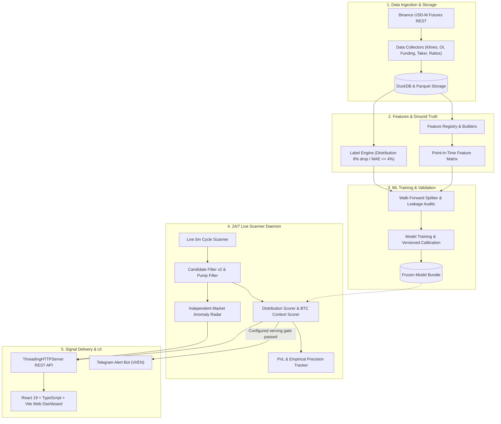

# 🏛️ DAO VANG (PeakPulse AI) — System Architecture

Welcome to the **DAO VANG (PeakPulse AI)** architectural documentation. This document provides an end-to-end technical overview of how the system ingests data, engineers features, calibrates predictive models, scans live cryptocurrency futures, and delivers signals to users.

---

## 🧭 1. Core Architectural Tenets

1. **Point-in-Time Safeguards:**
   - Feature calculations and inference are designed to consume only information available at or before each candle timestamp $t$.
   - Time-series joins use DuckDB `as-of` matching, while leakage audits and regression tests protect this contract. These controls reduce risk; they are not an absolute guarantee for every future data source or model revision.
2. **Deterministic Data & Query Engine:**
   - Powered by **DuckDB** and **Apache Parquet** for reproducible columnar storage and queries. Throughput depends on dataset size, hardware, and query shape and must be measured for each release environment.
3. **Frozen Model Bundles & Out-of-fold Calibration:**
   - Inference models are versioned and serialized with checksums. Calibration artifacts and metrics are attached to a specific bundle; no calibration threshold is claimed unless a version-linked evaluation report supports it.
4. **Human-in-the-Loop (Analytical Radar, No Auto-Trading):**
   - The platform serves as an early-warning signal radar. It does not execute automatic market orders.

---

## 🔄 2. End-to-End Dataflow & Pipeline

---

## 📂 3. Source Code Organization (`src/dao_vang/`)

The backend follows a **Modular Monolith** pattern organized cleanly by domain and functionality:

| Module Directory | Responsibility | Key Classes / Entrypoints |
| :--- | :--- | :--- |
| [`domain/`](../src/dao_vang/domain/) | Core domain types, enumerations, error definitions, and timezone-aware datetime helpers. | `DistributionEvent`, `MarketRegime`, `AppError` |
| [`config/`](../src/dao_vang/config/) | Pydantic v2 settings loading from `.env` and `configs/live.yaml`. | `AppSettings`, `get_settings()` |
| [`logging/`](../src/dao_vang/logging/) | Structured JSON/Console logging with automated sensitive secret redaction. | `get_logger()`, `redact_secrets()` |
| [`data/`](../src/dao_vang/data/) | Ingestion clients (Binance USD-M, Binance Agent OS token data, optional CoinGecko price cross-reference), schemas, data quality validation, and DuckDB storage. | `BinanceClient`, `KlinesCollector`, `DuckDBStorage` |
| [`features/`](../src/dao_vang/features/) | Point-in-time feature builders for Price, Open Interest, Funding Rate, Taker Volume, and Top Trader Ratios. | `FeatureRegistry`, `PriceFeatureBuilder`, `OIFeatureBuilder` |
| [`labels/`](../src/dao_vang/labels/) | Ground-truth labeling engine (identifying distribution tops: $\ge 8\%$ drop within 6-24h, MAE $\le 4\%$). | `LabelEngineV1`, `DistributionShortSpec` |
| [`baselines/`](../src/dao_vang/baselines/) | Rule-based heuristics and logistic regression baseline models for performance comparison. | `RuleBasedBaseline`, `LogisticBaseline` |
| [`validation/`](../src/dao_vang/validation/) | Walk-forward validation, embargo splitting, data leakage audits, and Brier / ECE calibration metrics. | `WalkForwardSplitter`, `LeakageAuditor`, `CalibrationMetrics` |
| [`experiments/`](../src/dao_vang/experiments/) | ML training runner, forward testing, ablation studies, and automated self-learning feedback loops. | `ExperimentRunner`, `SelfLearningDaemon` |
| [`scoring/`](../src/dao_vang/scoring/) | Live scoring engine combining frozen-model probabilities, BTC context, and evidence explanations. | `DistributionScorer`, `BTCContextScorer`, `EvidenceGenerator` |
| [`scanner/`](../src/dao_vang/scanner/) | 24/7 background scanner daemon, pump pattern detector, independent Market Anomaly Radar, Candidate Filter v2, watchlist manager, and signal outcome tracking. | `ScannerDaemon`, `PumpFilter`, `MarketAnomaly`, `TrackingWatchlist`, `CandidateFilterV2` |
| [`alerts/`](../src/dao_vang/alerts/) | Telegram alert delivery manager, bilingual message formatting (Vietnamese/English), and alert dedup store. | `TelegramAlertManager`, `AlertStore` |
| [`alpha_lab/`](../src/dao_vang/alpha_lab/) | Research modules for Triple Barrier evaluation, optional Meta-Labeling, Market Regime classification, and Drift Guardian. A module's presence does not mean it is enabled in live serving. | `AlphaBacktester`, `DriftGuardian`, `RegimeClassifier` |
| [`reports/`](../src/dao_vang/reports/) | HTML / Markdown summary report generator for backtest benchmarks and live operational audits. | `ReportGenerator` |
| [`web/`](../src/dao_vang/web/) | Custom threaded HTTP server providing REST endpoints and static frontend files. | `api_server.py`, `run.py` |
| [`cli/`](../src/dao_vang/cli/) | Typer CLI commands for manual data collection, backtesting, scanning, and model training. | `main.py` (`dao-vang`) |

---

## 💻 4. Frontend Architecture (`frontend/`)

The Web Dashboard is built with **React 19 + TypeScript + Vite**:

- **`src/components/MainWorkspace.tsx`**: Main trading cockpit containing interactive candlestick charts, live metrics (OI 24h, Funding, Taker Sell %, RSI), risk ratings, and deep analysis accordion.
- **`src/components/Sidebar.tsx`**: Navigation menu for Dashboard, Live Scanner, Signals Feed, Watchlist, Alpha Lab, and System Settings.
- **`src/components/SignalFeed.tsx`**: Polling-refreshed signal stream with hit/miss outcome badges, lead-time stats, and quick filtering.
- **`src/components/WatchlistPanel.tsx`**: Polling-refreshed watchlist tracking symbols under accumulation/distribution observation.
- **`src/components/AlphaLab.tsx`**: Visual research workbench for running Triple Barrier backtests, regime audits, and model feature-importance analysis.

---

## 🗄️ 5. Storage & Database Schema

DAO VANG utilizes a dual storage strategy:
1. **DuckDB Database (`dev.duckdb` / `live.duckdb`):**
   - Tables: `kline`, `open_interest`, `funding_rate`, `taker_ratio`, `top_position_ratio`, `scan_results`, `tracked_signals`, `alerts_sent`.
2. **Apache Parquet Files (`data/` / `data_live/`):**
   - Partitioned by `symbol/year/month` for high-throughput immutable historical storage.

---

## 🛡️ 6. Security & Operational Isolation

- **Separate Data Environments:** Development and production paths are configured independently. The current container stack mounts production data at `/app/data_live` and exposes the web service on port `8000`.
- **Credential Protection:** All tokens (Telegram API keys, webhooks) are loaded via environment variables and sanitized in all log outputs by `redact_secrets`.
- **Runtime Isolation:** The production containers run as a non-root UID/GID, expose liveness/readiness checks, and disable in-app self-updates. Releases are applied through the CI/CD pipeline.
