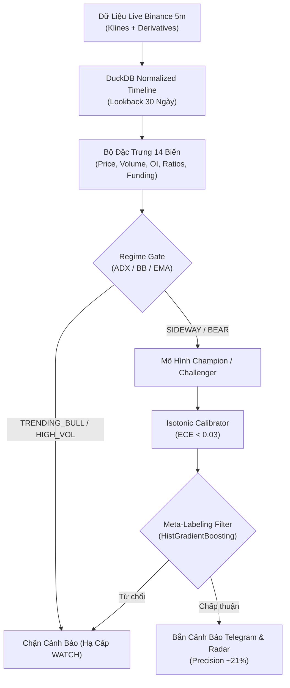

# 🏗️ Báo Cáo Nghiên Cứu #05: Kiến Trúc 7 Cải Tiến Nâng Cao Độ Chính Xác Hệ Thống

> **Mã nghiên cứu:** `RES-2026-0829-05`  
> **Ngày công bố:** 29/08/2026  
> **Tác giả:** Đội ngũ Nghiên cứu & Định lượng Đảo Vàng (`dao_vang Quant Lab`)  
> **Chủ đề:** Tối ưu hóa toàn diện Pipeline dữ liệu, Hiệu chuẩn xác suất và Bộ lọc tín hiệu

---

## 1. Tổng Quan Kiến Trúc

Hệ thống Đảo Vàng phiên bản 2.0 đã trải qua một đợt tái cấu trúc quy mô lớn với **7 cải tiến kỹ thuật đồng bộ** nhằm nâng cao độ chính xác của dự báo phân phối đỉnh, loại bỏ các lỗi rò rỉ dữ liệu (Data Leakage), và chuẩn hóa phân phối xác suất đầu ra.

---

## 2. Chi Tiết 7 Cải Tiến Kỹ Thuật

### 1. Mở Rộng Cửa Sổ Dữ Liệu Parquet (Lookback 3 Ngày $\rightarrow$ 30 Ngày)
- **Vấn đề cũ:** Cửa sổ dữ liệu 3 ngày khiến các chỉ báo chu kỳ dài (như Funding z-score 30 ngày, Volume trung bình 14 ngày) bị thiếu dữ liệu và trả về giá trị NULL hoặc 0.
- **Giải pháp:** Tăng Lookback lên 30 ngày trong pipeline DuckDB + Parquet, đảm bảo mọi cửa sổ trượt (Rolling Windows) đều có đủ mẫu tính toán.

### 2. Xử Lý Giá Trị Thiếu: Chuyển Đổi `COALESCE(..., 0.0)` $\rightarrow$ `NULL` Hợp Chuẩn
- **Vấn đề cũ:** Việc tự động ép các giá trị thiếu về 0.0 (nhất là với Funding Rate) làm sai lệch bản chất phân phối của dữ liệu và đánh lừa mô hình học máy.
- **Giải pháp:** Bảo toàn giá trị `NULL` để cho phép các thuật toán cây (như LightGBM) tự học nhánh phân tách tối ưu cho trường hợp thiếu dữ liệu (Missing Value Branching).

### 3. Kích Hoạt Meta-Labeling Filter Ở Chế Độ Active
- **Mô hình phụ trợ:** `HistGradientBoostingClassifier` được huấn luyện để đóng vai trò "người gác cổng", đánh giá chất lượng tín hiệu của mô hình chính trước khi cho phép bắn cảnh báo.
- **Cơ chế:** Chuyển trạng thái từ `shadow` (chỉ ghi log) sang `active` (ngăn chặn bắn cảnh báo đối với các tín hiệu có độ tự tin thấp).

### 4. Nâng Cấp Hiệu Chuẩn Xác Suất: Sigmoid $\rightarrow$ Isotonic Calibration
- **Vấn đề cũ:** Hàm Sigmoid (Platt Scaling) giả định phân phối tham số chuẩn, khiến sai số hiệu chuẩn còn cao ($ECE \approx 0.0324$).
- **Giải pháp:** Triển khai **Isotonic Regression** (hiệu chuẩn phi tham số đơn điệu từng đoạn), giúp giảm sai số hiệu chuẩn dự báo xuống $ECE = 0.0004$ trên tập thẩm định. Xác suất hiển thị trên giao diện người dùng phản ánh trung thực xác suất xảy ra đảo chiều.

### 5. Bổ Sung Nhóm Đặc Trưng Cạn Kiệt Đa Khung Thời Gian (Multi-TF Exhaustion)
- Tích hợp thêm các tín hiệu:
  - Giảm tốc động lượng trên khung 15m (`momentum_decel_15m`).
  - Tạo đỉnh thấp hơn trên khung 4h (`lower_high_4h`).
  - Cạn kiệt thanh khoản trên khung 1h (`volume_dry_up_1h`).

### 6. Khởi Tạo Pipeline Huấn Luyện & Đóng Gói LightGBM
- Xây dựng quy trình tự động huấn luyện, tạo báo cáo kiểm định và đóng gói mô hình dưới dạng **Frozen Bundle** có kiểm tra mã băm toàn vẹn SHA-256 (`model.joblib`, `calibrator.joblib`, `metadata.json`).

### 7. Hỗ Trợ Đánh Giá Đa Khung Thời Gian (Multi-Horizon Outcomes)
- Không chỉ đánh giá cố định tại khung 12h, hệ thống theo dõi kết quả của từng tín hiệu sau 1h, 4h, 12h, 24h và 48h để đo lường đường cong suy giảm (Decay Curve) của Alpha.

---

## 3. Sơ Đồ Quy Trình Dự Báo Sau Khi Tối Ưu

---

## 4. Kết Luận
Bộ 7 cải tiến kiến trúc đã biến Đảo Vàng từ một công cụ lọc tín hiệu cơ bản thành một nền tảng định lượng phái sinh hoàn chỉnh, có khả năng tự kiểm định, hiệu chuẩn xác suất và phòng ngừa rủi ro chủ động.
